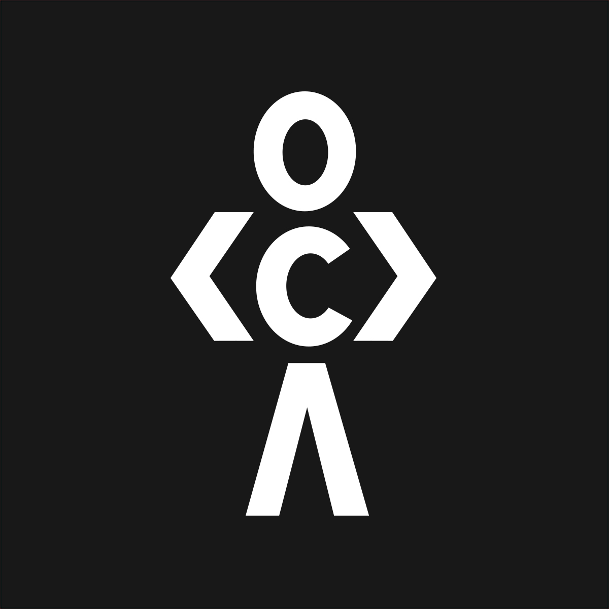

<h2 align="center"><a href="https://paths.sh">codedamn paths</a></h2>

Zero-To-100 industry level skillsets for you to become a senior developer.

## Roadmaps

Roadmaps (a.k.a learning paths a.k.a paths) are high quality and opinionated way of learning a stack of technologies for you to master it. It could be as wide as learning full-stack web development, or as narrow as mastering React.js

Some paths could be part of other paths, for example, mastering JavaScript could be a subpath inside full-stack web development roadmap.

Available roadmaps:

-   [Frontend web development](https://paths.sh/frontend)
-   [Backend web development](https://paths.sh/backend)
-   [Full stack web development](https://paths.sh/fullstack)
-   [Web 3.0 development](https://paths.sh/web3)
-   [Data Structures And Algorithms](https://paths.sh/dsa)

_More roadmaps coming soon_

## Contribution (Existing Roadmap)

In order to contribute, you can download any/all roadmaps inside `roadmaps` folder of this repository. Once you do, you have to download [balsamiq](https://balsamiq.com/).

Drag-and-drop a `.bmpr` file onto Balsamiq to get your roadmap inside the editor. Then, you can add or modify nodes or paths accordingly.

## Contribution (New Roadmap)

You may also submit a new `.bmpr`. We will accept a valid roadmap PR (and merge it in master too), however, it would only appear on codedamn.com paths page when there is enough content to support the roadmap.

If you're interested in creating interactive content for a roadmap on codedamn, you should checkout [creating interactive course guide](https://teach.codedamn.com/docs/instructor-guides/setup-course) and [YouTube playlist](https://www.youtube.com/watch?v=jwO28JdhncM&list=PLYxzS__5yYQnoUg4MCS2sew_tOZsgrUeH).
