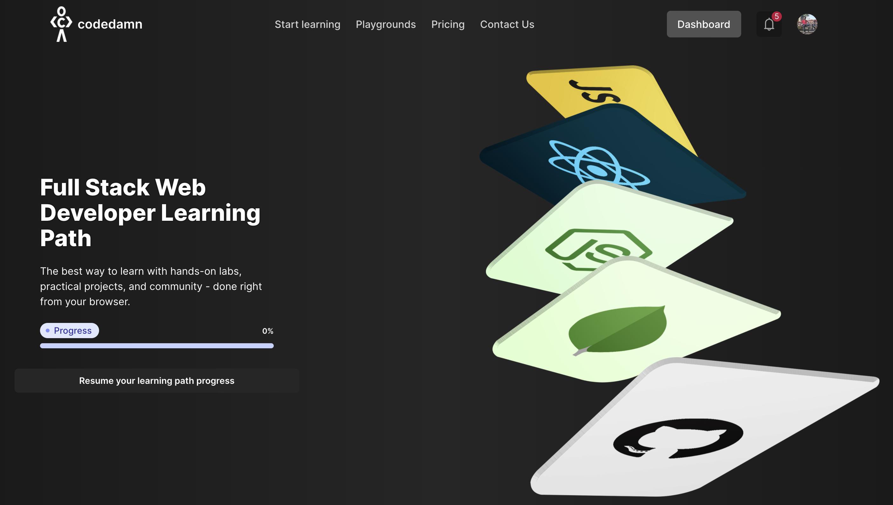

# Full Stack Learning Path

## Introduction

The [full-stack learning path by codedamn](https://codedamn.com/learning-paths/fullstack) is an interactive learning path to become a full-stack web developer using modern technologies. Our full-stack learning path consists of the following modules:

-   Module 1: Basics of the web
-   Module 2: Frontend Basics
-   Module 3: Frontend / Backend Tooling
-   Module 4: Mastering React.js
-   Module 5: Testing and skill evaluation
-   Module 6: Introduction to backend web development
-   Module 7: Node.js, MongoDB and REST/GraphQL
-   Module 8: Production Ready Practices

Explore all the modules on codedamn's learning path page. [Know more here](https://codedamn.com/learning-paths/fullstack)

## Concept table

Concept table in full-stack learning paths would list down the covered and missing content on codedamn on important concepts.

| Concept                    | Topic                 | Covered | URL                                          | Outdated |
| -------------------------- | --------------------- | ------- | -------------------------------------------- | -------- |
| DNS                        | Internet fundamentals | ✅      | https://codedamn.com/learn/http-fundamentals | No       |
| Port numbers               | Internet fundamentals | ✅      | https://codedamn.com/learn/http-fundamentals | No       |
| HTTP syntax                | Internet fundamentals | ✅      | https://codedamn.com/learn/http-fundamentals | No       |
| HTML basic tags            | HTML/CSS              | ✅      | https://codedamn.com/learn/html-css          | No       |
| CSS common selectors       | HTML/CSS              | ✅      | https://codedamn.com/learn/html-css          | No       |
| CSS Flexbox                | HTML/CSS              | ✅      | https://codedamn.com/learn/html-css          | No       |
| CSS Grid                   | HTML/CSS              | ✅      | https://codedamn.com/learn/html-css          | No       |
| CSS Positioning            | HTML/CSS              | ✅      | https://codedamn.com/learn/html-css          | No       |
| Using HTML+CSS together    | HTML/CSS              | ✅      | https://codedamn.com/learn/html-css          | No       |
| JavaScript syntax          | JavaScript            | ✅      | https://codedamn.com/learn/html-css          | No       |
| DOM and DOM manipulation   | JavaScript            | ✅      | https://codedamn.com/learn/javascript-basics | No       |
| Regular Expressions        | JavaScript            | ❌      | https://codedamn.com/learn/javascript-basics | -        |
| ES6 syntax                 | JavaScript            | ✅      | https://codedamn.com/learn/javascript-basics | No       |
| Using HTML+CSS+JS together | JavaScript            | ✅      | https://codedamn.com/learn/javascript-basics | No       |

## How to contribute?

-   Open an issue with a missing concept to be covered (https://github.com/codedamn/fullstack-learning-path/issues/new)
-   Open an issue with information about an outdated concept
-   Create an interactive codedamn lab for a missing concept [Coming soon]

## How to get rewarded by codedamn?

At codedamn.com, we link your contributions to community with our karma metric. Link your codedamn account with your GitHub account in your codedamn account settings (https://codedamn.com/settings).

On every merged PR / issue created, you would be rewarded karma. This karma (community contribution) is visible:

-   On your public profile at codedamn
-   In our Discord server
-   To companies you are applying for a job/internship via codedamn (increases your chances of selection) [Coming soon]

Karma can also be used to unlock special access to certain features on codedamn.com. More information here: https://codedamn.com/karma
